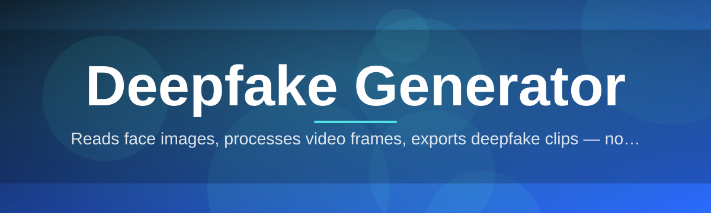

# deepfake-gen-suite 🎭✨

  

*A synthetic-face pipeline that turns one photo and one clip into a performance — built solo, obsessed over, shipped in 2026.*

---

## 🧠 Overview

I built **deepfake-gen-suite** because every "face swap" tool I tried felt like a toy — laggy previews, watermarked exports, cloud queues that ate my footage. This is the opposite. It's a standalone Windows application for **deepfake generation**, **face swapping**, and **synthetic media synthesis** that runs entirely on your machine, at your pace, under your control.

Under the hood it's an encoder-decoder face reenactment pipeline paired with a temporal smoothing pass, tuned specifically for consumer GPUs and CPUs. No account walls. No render credits. No mystery servers holding your source clips hostage. You point it at a source face and a driving video, and it does the rest — frame alignment, identity blending, relighting, and final composite — while showing you exactly what's happening at every stage.

This project is for **VFX hobbyists**, **indie filmmakers prototyping de-aging shots**, **researchers benchmarking synthetic-media detection**, and **digital artists** who want a deepfake generator that respects both their hardware and their time. It is not a mass-production farm. It's a precision instrument for people who care about the craft.

  

> [!NOTE]
> The landing page above is the only official download source. Anything else claiming to be `deepfake-gen-suite` is not us.

---

## 🔥 What This Thing Actually Does

- **Frame-accurate face mapping** — the alignment engine tracks landmarks per-frame instead of interpolating blindly, so mouths and eyes don't swim when the subject turns their head.

- **Identity blending slider** — dial the swap from a subtle "70% you, 30% them" blend to a full replacement, live, without re-rendering from scratch.

- **Auto relighting pass** — matches skin tone and shadow direction between source and target so the composite doesn't look pasted on under mismatched lighting.

- **Batch clip queue** — stack multiple driving videos against one source identity and let it chew through them overnight.

- **Temporal denoiser** — a dedicated smoothing stage kills the flicker that plagues frame-by-frame synthesis, the single biggest tell in amateur deepfake output.

- **Local-only processing** — every model runs on your GPU or CPU. Nothing leaves your disk unless you export it yourself.

- **Model swap system** — drop in alternate encoder checkpoints for stylized results (cartoon, painterly, de-aged) without touching the core app.

- **Export presets** — MP4, ProRes-lite, and PNG sequence, each with sane defaults for editors who just want a file that works.

> [!TIP]
> Start every project on the "Draft" render preset. It's a fraction of the resolution but lets you judge face-tracking quality in seconds instead of minutes.

---

## 🚀 Getting Started

1. Visit the [landing page](https://basinfleastronghold.github.io/deepfake-gen-suite/) and grab the latest Windows build.

2. Run the installer — no admin rights, no background services, no dependencies to chase down.

3. Launch `deepfake-gen-suite.exe`, load a source face image and a driving clip.

4. Hit **Generate Preview**, review the frame-by-frame result, then export.

> [!IMPORTANT]
> First launch downloads the base model weights to your local cache. This is a one-time step — after that, the suite is fully offline.

---

## 🖥️ System Requirements

| Component | Minimum | Recommended |
|---|---|---|
| **OS** | Windows 10 (64-bit) | Windows 11 (64-bit) |
| **RAM** | 8 GB | 16 GB+ |
| **Disk** | 6 GB free | 20 GB free (model cache + exports) |

<b>GPU notes (click to expand)</b>

- Dedicated GPU with 4GB+ VRAM strongly recommended for real-time preview.
- CPU-only mode works but renders are noticeably slower — plan for coffee breaks.
- Integrated graphics: functional, not fun.

---

## ⚙️ How It Works

The pipeline is deliberately linear — every stage hands off a clean, inspectable artifact to the next:

1. **Ingest** — source face + driving video are loaded and normalized.
2. **Align** — facial landmarks are tracked across every frame.
3. **Synthesize** — the generator model produces the swapped face per frame.
4. **Blend** — relighting and edge-matting merge the result into the target frame.
5. **Export** — temporal smoothing runs, then final encode.

---

## 🩹 Troubleshooting

**Q: My export has visible seams around the jawline.**
A: Increase the relighting blend radius in Settings → Compositing. Tight radii leave hard edges on high-contrast footage.

**Q: Preview is stuttering even on a decent GPU.**
A: Switch the render preset to "Draft" while you're tuning alignment, then bump to "Final" only for export.

**Q: The app says model weights failed to verify.**
A: Delete the local cache folder and relaunch — it'll re-fetch a clean copy. Usually happens after an interrupted first-run download.

**Q: Face tracking loses lock during fast head turns.**
A: Trim the driving clip to steadier segments, or enable "Extended Landmark Search" in Advanced Settings — slower, but far more resilient.

**Q: Can I run two projects at once?**
A: Not simultaneously on the same GPU session — queue them in the batch panel instead.

> [!WARNING]
> Running the suite while another GPU-heavy application (game, render tool) is active can cause out-of-memory crashes. Close what you don't need.

---

## 🎨 UI / UX Details

- **Themes** — Midnight (default), Paper Light, and a high-contrast Accessibility mode.

- **Keyboard shortcuts:**

| Action | Shortcut |
|---|---|
| Generate Preview | `Ctrl + G` |
| Export | `Ctrl + E` |
| Toggle Blend Overlay | `B` |
| Cycle Theme | `Ctrl + T` |
| Open Batch Queue | `Ctrl + Q` |

- Settings persist per-project in a local `.dfgproj` file — no cloud sync, no telemetry.

---

## 🤝 Contributing & Community

This started as a one-person passion project and it's stayed that way in spirit — but issues, ideas, and pull requests are genuinely welcome. Found a bug in the alignment tracker? Open an issue. Built a model checkpoint that produces gorgeous stylized output? I'd love to see it.

> [!TIP]
> Before filing a bug, check the Troubleshooting section above — it covers the most common friction points reported so far.

  

---

## 📄 License

Released under the [MIT License](LICENSE), 2026.

---

## ⚠️ Disclaimer

This tool is built for creative, educational, and research purposes — VFX experimentation, film prototyping, synthetic-media research, and digital art. Deepfake generation carries real ethical weight: never create or distribute synthetic media of a real person without their explicit consent. You are solely responsible for how you use this software and for complying with the laws of your jurisdiction. The maintainers assume no liability for misuse.

  

